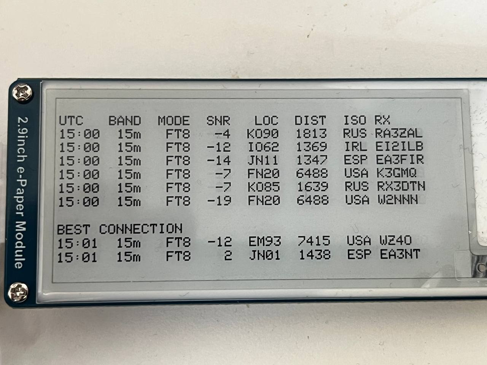

## ham-pocket-reporter — A Portable PSK Reporter Companion Device

ham-pocket-reporter is a lightweight, mobile PSK Reporter client built on an **ESP32** paired with a **2.9″ e‑paper display**.  
Its purpose: to monitor PSK Reporter spots in the field without constantly checking a smartphone.

A compact, ultra‑low‑power display provides immediate insight into who has received your signal—right next to your radio.

---

## 🎯 Idea & Motivation

When operating portable, constantly unlocking a smartphone drains battery and breaks focus.  
ham-pocket-reporter serves as a dedicated status companion for your radio setup, offering a minimal distraction approach while still giving you real‑time spot information.

---

## 📡 How It Works

- Connects to the **smartphone’s Wi‑Fi hotspot**
- Subscribes to the **PSK Reporter MQTT broker**, filtered for your callsign
- Processes all received data directly on the ESP32

---

## 🧮 Local Data Processing

ham-pocket-reporter adds meaningful context to raw spot data:

- **Distance calculation** using Maidenhead locators
- **Mapping call prefixes to ISO country codes** to simplify identification
- **Support for all modes provided by PSK Reporter**, including:
  - WSPR  
  - RBN  
  - FT8 / FT4 / FT2  
  - Others as supported by the MQTT stream

---

## 🚀 Planned Features

- Soft, unobtrusive acoustic feedback via a small beeper  
- Status LEDs for **Wi‑Fi** and **MQTT** connection  
- Hardware reset button  
- Improved power supply:
  - **Current:** USB via ESP32 dev board  
  - **Future:** compact battery-powered operation

---

## 📦 Hardware Overview (current prototype)

- ESP32 development board  
- 2.9″ black/white e‑paper display  
- 3D‑printed enclosure (optional)  
- USB power supply  

---

## 🛠️ Future Add‑Ons (ideas)

- Integrated battery management & charging  
- Optional GPS module for automatic locator updates  
- Configurable spotting filters and display modes  
- Web UI for configuration

---

## 📜 License

"THE BEER-WARE LICENSE" (Revision 42):
<mail@dl8ug.de> wrote this file.  As long as you retain this notice you
can do whatever you want with this stuff. If we meet some day, and you think
this stuff is worth it, you can buy me a beer in return. 73, DL8UG - Uwe

---

## 🤝 Contributions

Ideas, improvements, and pull requests are always welcome!

---

